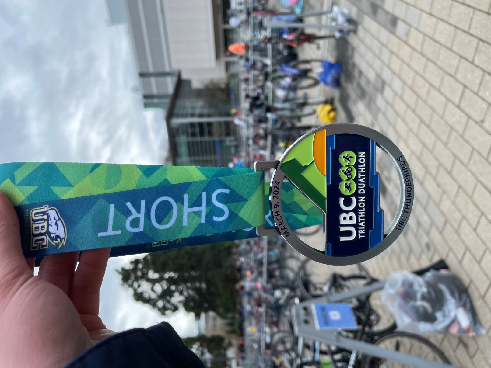

**Links**

* [Basic Ultrasound](http://folk.ntnu.no/stoylen/strainrate/Basic_ultrasound) A helpful online tutorial on ultrasound imaging.
* [Academic Phrasebank](https://www.phrasebank.manchester.ac.uk/) A website that contains many academic writing phrases and examples from the University of Manchester.
* [Learn Hands-only CPR](https://www.youtube.com/watch?v=qCAFx-ltco0) Don't have CPR certification? Hands-only CPR also saves life.
* [Careers in Science](https://www.science.org/careers/articles) A website where I learn what other people think about their life and career.
* [Slow Down](https://psyche.co/ideas/slow-down-its-what-your-brain-has-been-begging-for)
* [Depressive Realism](https://neu-reality.com/2020/03/depressive-realism/)
* [For every atom belonging to me as good belongs to you](https://www.poetryfoundation.org/poems/45477/song-of-myself-1892-version)

**What I am training for these days (besides my models!):**

