 

 
## Ultrasound Guidance for Transoral Robotic Surgery
*Sep 2021 – present, Robotics and Control Laboratory and Prisman Lab, UBC*
 
Head and neck-related cancers account for a large percentage of all cancers globally, and transoral robotic surgery (TORS) shows the potential to help preserve patient function after treatment. However, TORS is challenging because it requires surgeons to have profound knowledge of anatomy. We hypothesize that ultrasound guidance can improve treatment outcomes in head and neck cancers, and we aim at developing novel ultrasound technologies for robotic-assisted surgery. This work is summarized in my [PhD thesis](http://hdl.handle.net/2429/94072).

  

    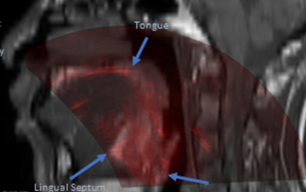
  

  

    <h3><a href="https://www.spiedigitallibrary.org/conference-proceedings-of-spie/12466/1246625/Feasibility-of-MRI-US-registration-in-oropharynx-for-transoral-robotic/10.1117/12.2655032.short">Feasibility of MRI-US registration in the oropharynx</a></h3>
    
<em>SPIE Medical Imaging</em>, 2023

    
Feasibility study for semi-automatic MRI-to-US registration to support system calibration for TORS.

  

  

    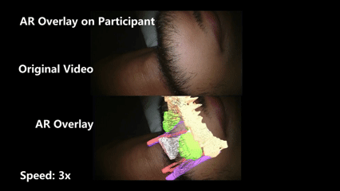
  

  

    <h3><a href="https://link.springer.com/article/10.1007/s11548-023-02898-y">Ultrasound-guided augmented reality system for TORS</a></h3>
    
<em>IJCARS</em>, 2023 &middot; <a href="https://arxiv.org/abs/2211.16544">arXiv</a>

    
System design and prototype of the first ultrasound-guided augmented reality system for TORS.

  

  

    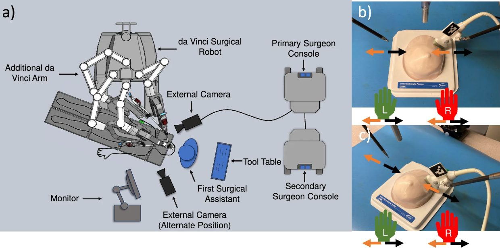
  

  

    <h3><a href="https://link.springer.com/article/10.1007/s11548-024-03160-9">Robot-assisted ultrasound scanning for TORS</a></h3>
    
<em>IJCARS</em>, 2024

    
Exploring robotic manipulation of the ultrasound probe to perform intraoperative scans during TORS.

  

  

    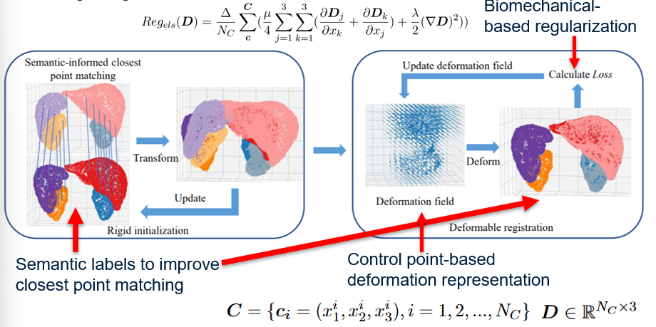
  

  

    <h3><a href="https://arxiv.org/abs/2503.00972">Point cloud registration using semantic information and biomechanical energy regularization</a></h3>
    
<em>arXiv</em>, 2025

    
A non-rigid registration framework incorporating semantic segmentation and biomechanical priors.

  

  

    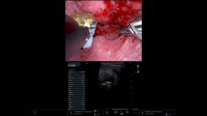
  

  

    <h3><a href="https://www.sciencedirect.com/science/article/pii/S1368837524004858">Clinical evaluation of transcervical ultrasound in TORS</a></h3>
    
<em>Oral Oncology</em>, 2024 &middot; <a href="https://www.spiedigitallibrary.org/conference-proceedings-of-spie/13927/139270Q/Integrating-transcervical-ultrasound-with-transoral-robotic-surgery-for-head-and/10.1117/12.3088212.short">SPIE Medical Imaging 2026</a>

    
Clinical evaluation of ultrasound integration in TORS with the Prisman Lab.

  

## Tissue Tracking and Landmark Retrieval in Ultrasound
*Jan 2023 – Jul 2025, Robotics and Control Laboratory, UBC*
 
I am broadly interested in representation learning and self-supervised learning for ultrasound image analysis — specifically, how models can learn pixel- or frame-wise representations for ultrasound that transfer to downstream tasks like tracking and information retrieval.
 

  

    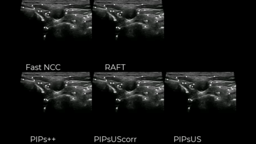
  

  

    <h3><a href="https://link.springer.com/chapter/10.1007/978-3-031-73647-6_5">A tracking-any-point model for ultrasound</a></h3>
    
<em>ASMUS</em>, 2024 &middot; <a href="https://arxiv.org/abs/2403.04969">arXiv</a>

    
A new tracking-any-point model for ultrasound that outperforms state-of-the-art optical flow.

  

  

    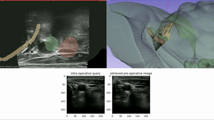
  

  

    <h3><a href="https://link.springer.com/article/10.1007/s11548-025-03394-1">Self-supervised representation learning for ultrasound view retrieval</a></h3>
    
<em>IJCARS</em>, 2025 &middot; <a href="https://arxiv.org/abs/2412.07741">arXiv</a>

    
Leverages intra-sweep temporal information to improve classical contrastive learning for view retrieval.

  

## AI in Lung Ultrasound COVID-19 Diagnosis and Segmentation
*Nov 2020 – Aug 2021, Biomedical Image Guidance Lab, Carnegie Mellon University*
 
This project developed AI tools for ultrasound image analysis, including lung region segmentation algorithms used to evaluate how different lung regions affect AI accuracy in COVID-19 severity classification, and optical flow methods to improve semantic segmentation accuracy.
 

  

    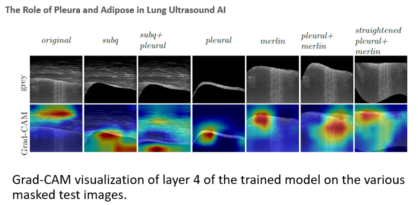
  

  

    <h3><a href="https://link.springer.com/chapter/10.1007/978-3-030-90874-4_14">Lung region segmentation for COVID-19 severity classification in ultrasound</a></h3>
    
<em>MICCAI LL-COVID19 Workshop</em>, 2021

    
Lung segmentation and optical flow-based methods to improve AI accuracy in COVID-19 severity classification.

  

## Robotic Needle Steering and Tracking
*Sep 2019 – Aug 2021, Biomedical Image Guidance Lab, Carnegie Mellon University*
 
My research focused on ultrasound-based needle tracking and steering, including robust tracking under bending or partial visibility, lateral-manipulation-based steering control, and recalibration between robot kinematics and ultrasound coordinates.
 

  

    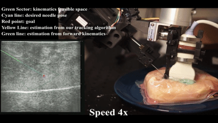
  

  

    <h3><a href="https://ieeexplore.ieee.org/abstract/document/9433804">Dual-path bending needle tracking in ultrasound</a></h3>
    
<em>ISBI</em>, 2021

    
A bending needle tracking algorithm utilizing kinematic consistency in segmentation to improve accuracy.

  

  

    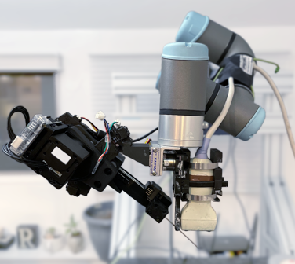
  

  

    <h3><a href="https://www.ri.cmu.edu/publications/ultrasound-based-needle-tracking-and-lateral-manipulation-planning-for-common-needle-steering/">Ultrasound-based needle tracking and lateral manipulation planning for common needle steering</a></h3>
    
<em>M.S. Thesis</em>, Carnegie Mellon University, 2021

    
Improved mechanical modeling of needle-tissue interaction and two replanning algorithms for lateral-manipulation-based needle steering, removing the need for manual insertion point selection.

  

## Early Research at Peking University
*2017 – 2019, The Robotics Research Group, Peking University*
 
Before graduate school, I worked on sensor fusion for attitude estimation, human swimming locomotion analysis using IMUs, and locomotion mode recognition for lower-limb prostheses.
 

  

    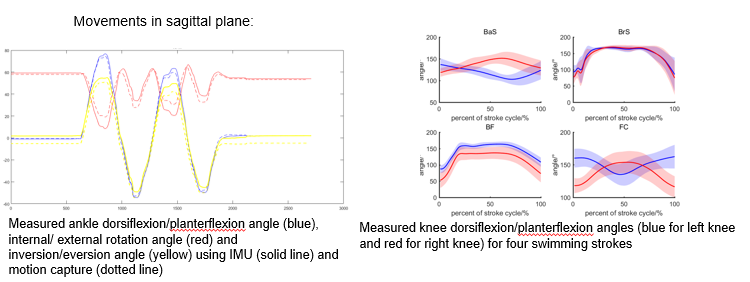
  

  

    <h3><a href="https://ieeexplore.ieee.org/abstract/document/9090211/">Analysis of human swimming locomotion using IMUs</a></h3>
    
<em>IEEE TMRB</em>, 2019

    
IMU-based joint angle measurement system compared against optical motion capture for swimming analysis.

  

  

    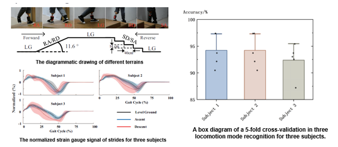
  

  

    <h3><a href="https://www.tandfonline.com/doi/abs/10.1080/01691864.2018.1563500">Environment-aware locomotion mode recognition of lower limb prostheses</a></h3>
    
<em>Advanced Robotics</em>, 2018

    
A CNN-based locomotion mode recognition method using raw strain gauge signals.

  

  

    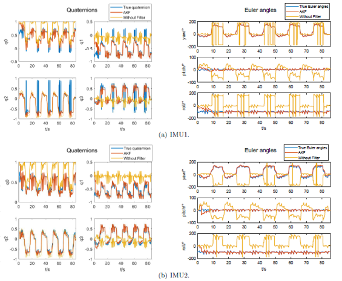
  

  

    <h3>Sensor fusion for attitude measurement based on quaternions and Kalman filter</h3>
    
Undergraduate Thesis, Peking University, 2019

    
Kalman filter-based fusion of nine-axis IMU data (accelerometer, gyroscope, magnetometer) for real-time attitude estimation.

  

  

    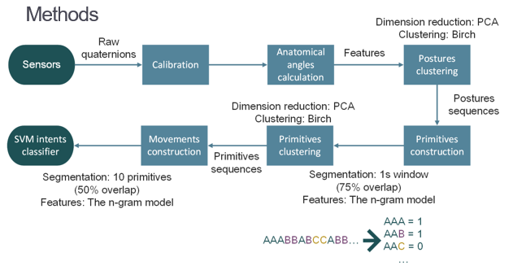
  

  

    <h3>Human hand motion primitives during haptic search and retrieval of buried objects</h3>
    
Biomechatronics Lab, UCLA, 2018

    
Modeled hand movement sequences during search-and-retrieval tasks using NLP-inspired motion primitive representations.

  

&times;

